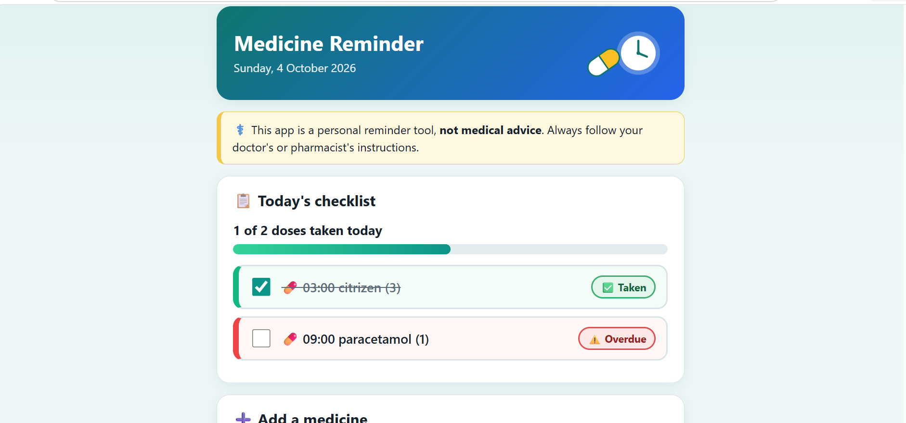

# medicine-reminder-tracker
# Medicine Reminder Tracker

A simple daily checklist that helps people remember to take their medicines.

> **Note:** This app is a personal reminder tool, **not medical advice**. Always follow your doctor's or pharmacist's instructions.

## Problem
Managing several medicines a day is easy to get wrong, especially for elderly people. Paper lists and phone alarms don't show what has already been taken today.

## Solution
Add your medicines once, with the times you take them. The app builds today's checklist, sorted by time, and shows each dose as upcoming, due, overdue, or taken. Each new day starts fresh automatically.

## Features
- Add a medicine with a name, dose, and one or more times
- Today's checklist sorted by time, with tick boxes
- Status labels (Upcoming, Due now, Overdue, Taken) using colour **and** text, so they work for colour-blind users
- Progress summary ("3 of 5 doses taken today") with a progress bar
- Delete a medicine, with confirmation
- Data saved in the browser (localStorage) and reset daily
- Large, readable text for elderly users

## How to run
1. Clone the repo: `git clone https://github.com/Columbus231/medicine-reminder-tracker.git`
2. Open the folder and double-click `index.html`

No installation, build step, or internet connection needed.

## Tech stack
- HTML, CSS, and plain JavaScript (no frameworks or libraries)
- Browser `localStorage` for saving data

## How I used AI
I used Claude as my AI assistant throughout. My process:
1. **Ideation:** asked for 3 project ideas with users, features, and risks, then chose one.
2. **Planning:** had the AI write a `PLAN.md` with a data model, status rules, and build order before any code.
3. **Building:** one feature per prompt (form, checklist, statuses, delete, progress), committing after each.
4. **Debugging:** I hit three real problems and fixed each one:
   - **Broken Save button (twice).** After adding status indicators, and again after adding delete, the "Save medicine" button stopped working and the browser console showed no errors. The cause was a partial copy-paste: an old function line was left behind, so the rest of the file ended up nested inside a function that never ran. I found it by sharing my full `app.js` with the AI, then fixed it by replacing the whole file instead of patching pieces. Now I commit a working version before each new feature, so I can restore it if a paste goes wrong.
   - **Confusing time input.** Saving a medicine failed with "Please add at least one time" even when I had picked a valid time, because I hadn't clicked the separate "Add time" button. The code worked as designed, but the two-step flow was confusing for the target users. I changed Save to also accept a valid time typed in the box, and added a hint about adding multiple times.
5. **Verification:** I ran every feature myself and tested edge cases rather than trusting the AI output.

The full prompt history is in [`prompts.md`](prompts.md), and the plan is in [`PLAN.md`](PLAN.md).

## Limitations and future improvements
- No push notifications or alarms (browsers can't reliably do this without a backend)
- Data lives only in one browser, with no accounts or sync
- Edit an existing medicine
- 7-day history
- Large-text mode toggle
